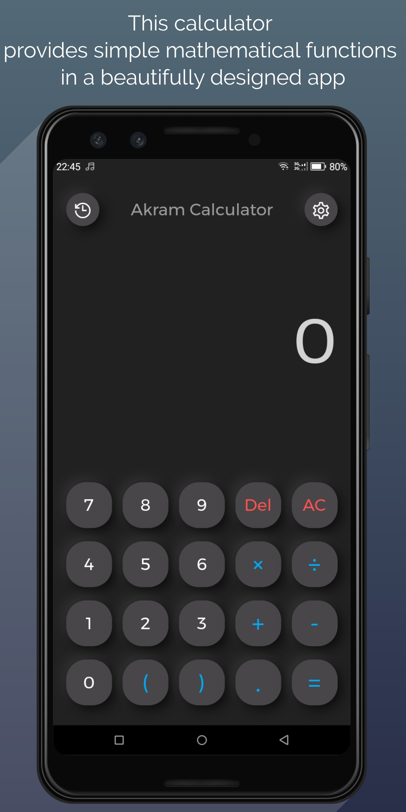
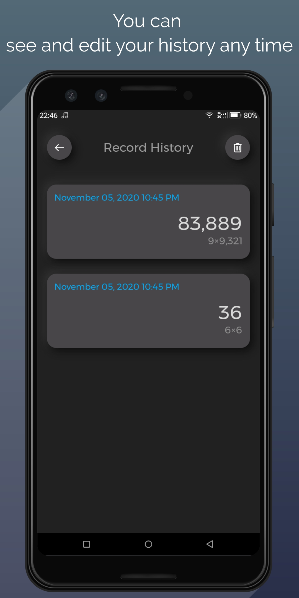
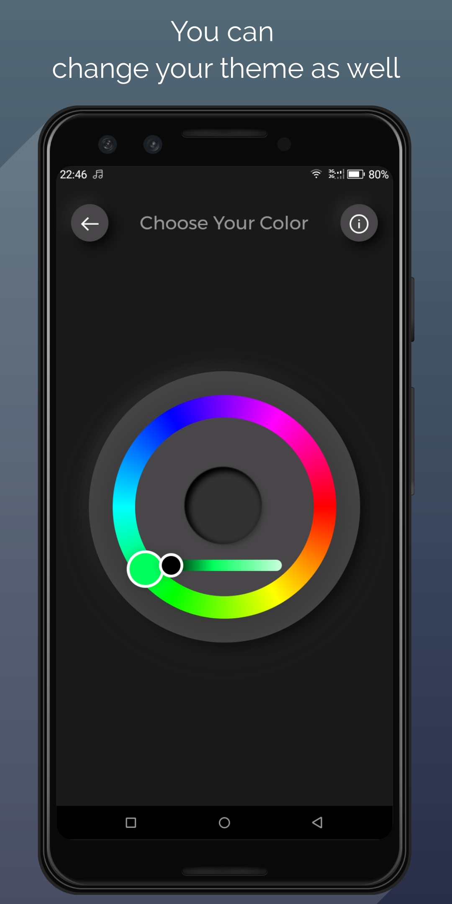
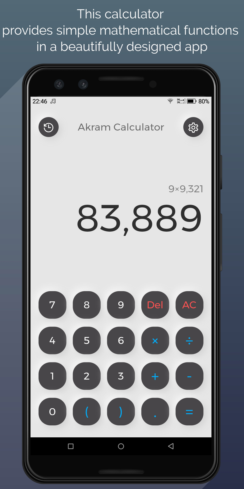
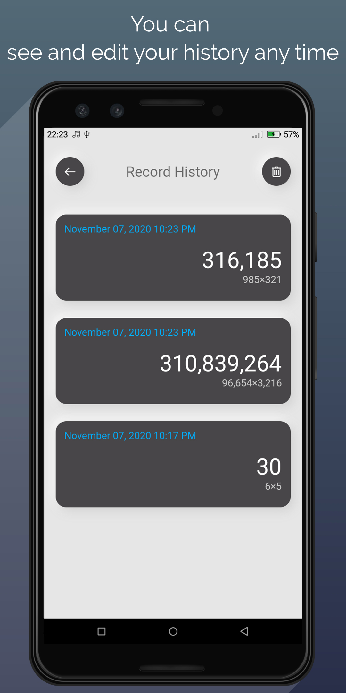
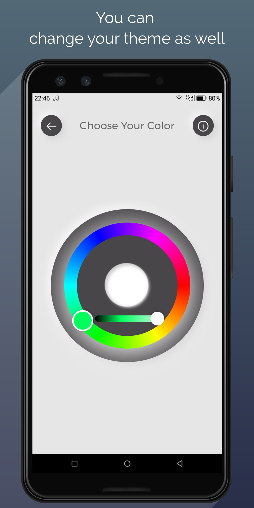

# Akram Calculator App built with Flutter

This is a calculator application built using Flutter.
This calculator provides simple mathematical functions in a beautifully designed app. 
It built with Admob. 
Enjoy it :)

## Install App From Playstore
- [Download this app from playstore](https://play.google.com/store/apps/details?id=com.akramghaleb.akramcalculator)
## Running the app

Follow the steps below to run the app on your local machine.
You'll need to make sure you have flutter installed and either Android Studio and XCode installed to test this application in a simulator.
Let me know if you encounter issues with the calculator

1. Make sure to have `flutter` installed on your machine
2. Clone the repository to your local machine
3. Open an emulator and run `flutter run` within the cloned repo's folder.
4. Try it out.

| Calculator Screen | History Screen | Color Background Change |
| --- | --- | ---|
|  |  |  |
|  |  |  |

## Getting Started

This project is a starting point for a Flutter application.

A few resources to get you started if this is your first Flutter project:

- [Lab: Write your first Flutter app](https://flutter.dev/docs/get-started/codelab)
- [Cookbook: Useful Flutter samples](https://flutter.dev/docs/cookbook)

For help getting started with Flutter, view our
[online documentation](https://flutter.dev/docs), which offers tutorials,
samples, guidance on mobile development, and a full API reference.
